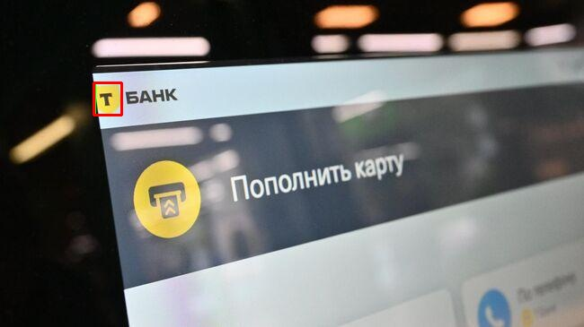
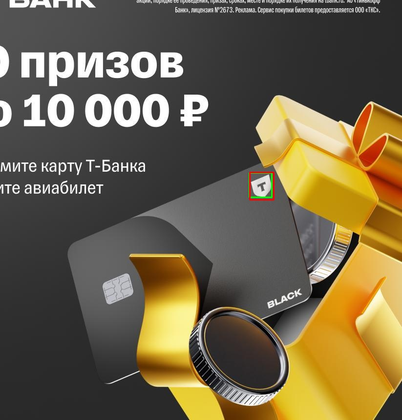

# Детекция логотипа Т-Банка
Проект представляет собой API-сервис для автоматического обнаружения логотипа Т-Банк на изображениях. Решение основано на модели компьютерного зрения YOLO, обернуто в FastAPI для быстрого развертывания и контейнеризовано с помощью Docker.
## Технологический стек
- **Python 3.9**
- **Ultralytics (YOLO)**: для обучения и инференса модели детекции.
- **FastAPI**: для создания асинхронного и производительного API.
- **Uvicorn**: как ASGI-сервер для запуска FastAPI.
- **Docker**: для контейнеризации и изоляции приложения.
- **OpenCV & Pandas**: для обработки данных и изображений в скриптах валидации.

## Подход к решению
### Модель
Процесс обучения модели проходил на платформе **Kaggle** для использования мощностей GPU. Ниже описаны ключевые этапы, которые были пройдены для получения итоговых весов.
### 1. Сбор и разметка данных
- **Сбор данных**: Был собран кастомный набор изображений, содержащих логотип Т-Банк в различных ракурсах, условиях освещения и на разных фонах.
- **Разметка**: Для разметки изображений (создания bounding boxes вокруг логотипов) использовался онлайн-сервис **Roboflow**. Этот инструмент позволил удобно и быстро аннотировать данные.
- **Экспорт**: После разметки, датасет был экспортирован из Roboflow в формате **YOLO (.txt)** и загружен на Kaggle.

### 2. Конфигурация обучения
- **Выбор модели**: В качестве основы была выбрана предварительно обученная модель **YOLOv8m** (`yolov8m.pt`), которая представляет собой хороший баланс между скоростью и точностью.
- **Параметры обучения**: Модель обучалась в Kaggle-ноутбуке со следующими ключевыми параметрами:
    - **`data`**: `/kaggle/input/t-bank-logos/data.yaml` (путь к конфигурации датасета на Kaggle)
    - **`epochs`**: 100
    - **`imgsz`**: 640
    - **`batch`**: 16
    - **`augment`**: `True`
    - **`dropout`**: 0.2
    - **`patience`**: 25
    - **`single_cls`**: `True`

### 3. Результаты обучения
По завершении процесса обучения, лучшая модель (с наилучшими показателями на валидационной выборке) была сохранена как файл `best.pt`. Именно эти веса используются в данном API-сервисе для детекции логотипов.
### API
Для взаимодействия с моделью реализован REST API на FastAPI. Он предоставляет один endpoint `/detect`, который принимает изображение и возвращает координаты bounding boxes, найденных логотипов в формате JSON.
### Контейнеризация
Все приложение, включая модель и зависимости, упаковано в Docker-образ.

## Работа с данными
Для оценки качества модели используется валидационная выборка. Исходные данные для нее были в формате **YOLO (.txt)**, который не удобен для прямого сравнения.
Процесс подготовки данных для валидации:
1. **Исходный формат**: Для каждого изображения (`.jpg`, `.png`) имелся текстовый файл (`.txt`) с тем же именем. Каждая строка в `.txt` файле содержала класс объекта и его координаты в нормализованном формате (от 0 до 1).
2. **Конвертация**: С помощью скрипта `scripts/convert_yolo_to_csv.py` была произведена конвертация. Скрипт проходится по всем `.txt` файлам, считывает размеры соответствующих им изображений и переводит относительные YOLO-координаты в **абсолютные пиксельные координаты** (`x_min`, `y_min`, `x_max`, `y_max`)
3. **Итоговый формат**: Все данные были собраны в единый файл `data/validation/labels.csv`. Этот CSV-файл используется скриптом `scripts/validate.py` как источник правдивых данных для сравнения с предсказаниями модели.

## Инструкции по запуску и использованию (Docker)
Это основной и рекомендуемый способ запуска приложения.

### 1. Клонируйте репозиторий
``` bash
    git clone https://github.com/rt-yty/T-Bank-logo-detection
    cd T-Bank-logo-detection
```
### 2. Загрузите веса модели
Перед сборкой образа необходимо скачать файл с весами обученной модели (`best.pt`) и поместить его в папку `weights/`.
**[Скачать веса модели](https://disk.yandex.ru/d/RyOYTNS2GcZaLA)**
После скачивания убедитесь, что структура папок выглядит так:
``` 
.
├── weights/
│   └── best.pt
├── Dockerfile
└── ...
```
### 3. Соберите и запустите Docker-контейнер
Выполните сборку Docker-образа и запустите контейнер. Все зависимости будут установлены автоматически внутри контейнера.
``` bash
# Собрать Docker-образ
docker build -t tbank-logo-detection .

# Запустить контейнер
docker run -p 8000:8000 tbank-logo-detection
```
Сервис будет доступен по адресу `http://localhost:8000`.
### 4. Отправка запроса к API
Откройте документацию API в браузере `http://localhost:8000/docs`, чтобы увидеть все доступные эндпоинты и протестировать их.
Для отправки изображения на сервер можно использовать `curl`:
``` bash
curl -X POST -F "file=@/путь/к/вашему/изображению.jpg" http://localhost:8000/detect
```
**Пример успешного ответа:**
``` json
{
  "detections": [
    {
      "bbox": {
        "x_min": 150,
        "y_min": 200,
        "x_max": 250,
        "y_max": 230
      }
    }
  ]
}
```
## Валидация модели и работа с данными
Для оценки качества модели и воспроизводимости результатов предусмотрен скрипт валидации.
### 1. Подготовка данных для валидации
Для запуска скриптов валидации вам понадобится валидационная выборка.
**[Скачать валидационную выборку](https://disk.yandex.ru/d/IvjnvXRp7yWDZw)**
1. Распакуйте архив и поместите изображения в папку `data/validation/images/`, а файлы разметки в формате YOLO (`.txt`) в папку `data/validation/labels/`.
2. Создайте и активируйте виртуальное окружение, установите зависимости:
``` bash
# Создать и активировать окружение
python -m venv .venv
source .venv/bin/activate   # Для MacOs/Linux
.venv\Scripts\activate      # Для Windows

# Установить зависимости
pip install -r requirements.txt
```
3. Конвертируйте разметку из формата YOLO в `labels.csv`, который используется для валидации:
``` bash
python scripts/convert_yolo_to_csv.py
```
### 2. Запуск скрипта валидации
После подготовки данных можно оценить качество модели.
1. **Запустите скрипт валидации для расчета метрик:**
``` bash
python scripts/validate.py
```
В консоли появятся метрики `Precision`, `Recall` и `F1-score`.

2. **Для получения визуальных результатов** с отрисованными рамками предсказаний:
``` bash
python scripts/validate.py --draw-results
```
В корне проекта будет создана папка `validation_results/` с изображениями.

## Результаты работы модели
### Метрики качества
Валидация проводилась на кастомной выборке с порогом `IoU = 0.5`.
- **Precision (Точность)**: `0.8955`
- **Recall (Полнота)**: `0.8333`
- **F1-score**: `0.8633`

### Визуальные примеры
Ниже приведены примеры работы модели на изображениях из валидационной выборки (остальные можно посмотреть в директории [validation_results/](validation_results/) . Зеленая рамка обозначает эталон, красная — предсказание модели.




Как видно на изображениях, модель успешно справляется с обнаружением логотипа даже в не самых простых условиях.

## Дополнительная информация

### Альтернативные подходы к решению
- **Другие архитектуры моделей**: Вместо YOLOv8 можно было бы использовать другие архитектуры, такие как **Faster R-CNN** или **EfficientDet**. Они могли бы показать незначительно более высокую точность, но, как правило, уступают YOLO в скорости инференса. Выбор YOLOv8 является оптимальным для создания быстрого API.
- **Классическое компьютерное зрение**: Для очень простых и однородных изображений можно было бы применить **поиск по шаблону** (`template matching` в OpenCV). Однако этот метод крайне неустойчив к изменениям масштаба, поворота и освещения, поэтому для реальной задачи он не подходит.
- **Облачные Vision API**: Можно было бы воспользоваться готовыми сервисами, такими как **Google Cloud Vision** или **Amazon Rekognition**. Это сняло бы необходимость в обучении и поддержке своей модели, но привело бы к зависимости от внешнего провайдера и потенциально более высоким затратам.

### Анализ проблем и возможные улучшения
- **Проблема**: Ложные срабатывания (False Positives) или пропуски логотипа (False Negatives).
- **Решение**:
    - **Расширенная аугментация**: Добавить в обучающий набор больше сложных примеров: частично перекрытые логотипы, изображения с размытием, шумом.
    - **Hard Negative Mining**: Целенаправленно добавить в датасет изображения без логотипа, но с похожими на него элементами, чтобы "запутать" модель и научить ее отличать их.
    - **Подбор порога уверенности**: В API можно динамически изменять порог уверенности детекции. Более высокий порог уменьшит количество ложных срабатываний, но может увеличить число пропусков.

- **Проблема**: Недостаток размеченных данных и их качества для обучения/тестирования модели
- **Решение**: Использовать другой более качественный сервис для разметки, но такой скорее всего будет платным (**Roboflow** был бесплаьным, но с ограничением на количество аннотаций)

- **Проблема**: Изменение дизайна логотипа (ребрендинг).
- **Решение**: Настроить MLOps-процесс для **непрерывного дообучения**. При появлении новых версий логотипа можно быстро собрать небольшой датасет и дообучить модель, чтобы она оставалась актуальной.

### Анализ производительности и варианты ускорения
Текущее решение на FastAPI и Uvicorn является асинхронным и быстрым. Основное узкое место — это время инференса самой модели.
- **Аппаратное ускорение (GPU)**: Самый эффективный способ ускорения. Для этого необходимо запустить Docker-контейнер на сервере с NVIDIA GPU, используя `nvidia-docker` и базовый Docker-образ с поддержкой CUDA. Это потребует модификации `Dockerfile`.
- **Оптимизация модели**:
    - **Квантизация**: Преобразование весов модели из формата FP32 в FP16 или INT8. Это значительно уменьшает размер модели и ускоряет вычисления, особенно на CPU, с минимальной потерей точности. Библиотека `ultralytics` поддерживает экспорт в эти форматы.
    - **Конвертация в TensorRT**: Для инференса на GPU NVIDIA можно конвертировать модель в формат TensorRT. Это дает существенный прирост производительности за счет оптимизации графа вычислений под конкретное железо.
    - **Использование более легкой модели**: Замена `yolov8m.pt` на `yolov8s.pt` или `yolov8n.pt` — самый простой способ ускорить инференс, если допустимо небольшое снижение точности.
